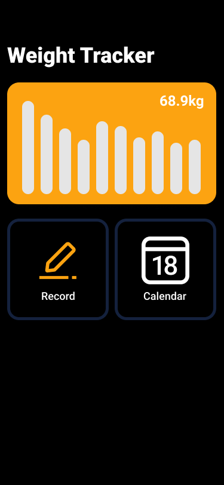
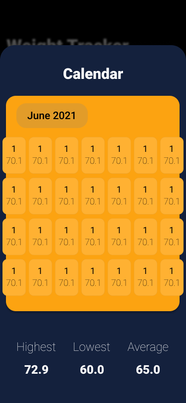

# Weight Tracker

A weight tracking app written in React, and uses localStorage to save the weights to the device.

## Plans

- [x] Create a mockup
- [x] Create the ui
- [ ] Add functionality
- [ ] Maybe add ways to store online?

## Mockups

| Home                     | Add                    | Calendar                         |
| ------------------------ | ---------------------- | -------------------------------- |
|  |  |  |
